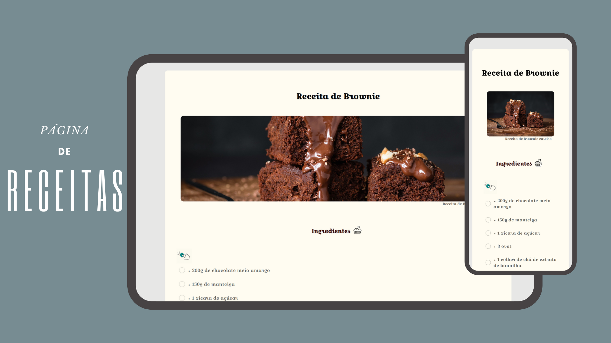

<h1 align="center"> DevLinks </h1>

Instruído pela Rocketseat para desenvolvimento de tecnologias da web.

  <a href="#-tecnologias">Tecnologias</a>&nbsp;&nbsp;&nbsp;|&nbsp;&nbsp;&nbsp;
  <a href="#-projeto">Projeto</a>&nbsp;&nbsp;&nbsp;|&nbsp;&nbsp;&nbsp;
  <a href="#-layout">Layout</a>&nbsp;&nbsp;&nbsp;|&nbsp;&nbsp;&nbsp;
  <a href="#memo-licença">Licença</a>

  

 

  

## 🚀 Tecnologias

Esse projeto foi desenvolvido com as seguintes tecnologias:

- HTML e CSS
- JavaScript
- Git e Github
- Canva

## 💻 Projeto

Esta página de receita de brownie foi desenvolvida com o objetivo de aprimorar habilidades de desenvolvimento front-end. A receita é apresentada de forma clara e atraente, tornando mais fácil para os usuários seguirem as instruções. Foram utilizadas tecnologias como HTML, CSS e JavaScript para criar uma interface interativa e agradável.

## 🔖 Layout

- Layout cuidadosamente planejado para aprimorar a experiência visual.
  
- Elementos dispostos para facilitar a leitura das instruções e visualização das imagens.
 
- Cores suaves e imagens apetitosas criam um ambiente convidativo.
 
- Botões e elementos integrados à lista de ingredientes para organização e experiência aprimorada.

## :memo: Licença

Esse projeto está sob a licença MIT.

---
